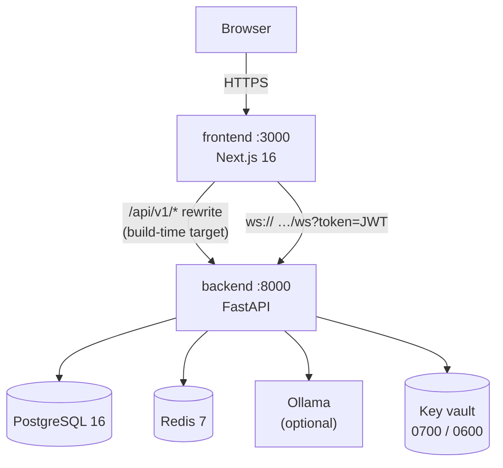

# Architecture

**Version:** 3.3.0
**Audience:** engineers onboarding to the codebase

---

## Contents

1. [System overview](#system-overview)
2. [Request lifecycle](#request-lifecycle)
3. [Layering rules](#layering-rules)
4. [Backend modules](#backend-modules)
5. [Frontend](#frontend)
6. [Data and state](#data-and-state)
7. [Security model](#security-model)
8. [Design decisions and their reasons](#design-decisions-and-their-reasons)
9. [Known architectural gaps](#known-architectural-gaps)

---

## System overview

Four containers, one network:

| Service | Image | Role | User |
|---|---|---|---|
| `frontend` | `node:22-alpine` | Next.js 16 dashboard, serves `/` and proxies `/api/v1/*` | `nextjs` (1001) |
| `backend` | `python:3.12-slim-bookworm` | FastAPI application, business logic | `appuser` (1001) |
| `postgres` | `postgres:16` | durable state | — |
| `redis` | `redis:7` | WebSocket pub/sub fan-out | — |

Ollama is an optional external dependency reached through
`host.docker.internal:11434`.


```mermaid
flowchart TB
    Browser -->|HTTPS| FE["frontend :3000<br/>Next.js 16"]
    FE -->|"/api/v1/* rewrite<br/>(build-time target)"| BE["backend :8000<br/>FastAPI"]
    FE -->|"ws:// …/ws?token=JWT"| BE
    BE --> PG[("PostgreSQL 16")]
    BE --> RD[("Redis 7")]
    BE --> OL["Ollama<br/>(optional)"]
    BE --> VAULT[("Key vault<br/>0700 / 0600")]
```

---

## Request lifecycle

Every HTTP request passes through a fixed middleware chain, then into one of
three router groups, then into a domain service.

```
request
  │
  ├─ CORSMiddleware                 ← allowlist from BACKEND_CORS_ORIGINS
  ├─ RequestLoggingMiddleware       ← correlation id, structured JSON log
  ├─ ErrorHandlingMiddleware        ← maps exceptions to stable error shape
  │
  ├─ public_router                  ← no token required (deliberate)
  ├─ protected_router               ← Depends(get_current_active_user)
  ├─ realtime_router                ← validates ?token= during handshake
  └─ ad-hoc routes in main.py       ← ⚠ no auth yet (ROADMAP phase 1)
        │
        ├─ risk_engine              ← deterministic, no I/O
        ├─ services/trading.py      ← Nobitex client + managers
        ├─ core/agent.py            ← AgentBrain singleton
        └─ core/vault.py            ← filesystem key vault
```

### Authentication path

```
POST /api/v1/auth/login
  → OAuth2PasswordRequestForm (username + password)
  → bcrypt.checkpw(password, stored_hash)          # cost 12, $2b$ prefix
  → create_access_token({"sub": str(user.id), "iat": …, "exp": now+30m, "role": …})
  → {"access_token": …, "token_type": "bearer"}
```

`sub` carries the **integer** user id. An earlier version coerced it with
`int()` in a way that broke every authenticated request; the claim is now an
int and is read as an int.

---

## Layering rules

The codebase follows a deliberate layering. The rule is enforced by convention
and by the wiring tests:

| Layer | Directory | May depend on | Must not depend on |
|---|---|---|---|
| Delivery | `api/v1/` | `core/`, `services/`, `risk_engine/` | `db/` models directly, other routers |
| Domain | `risk_engine/`, `agent/` | `core/`, stdlib, numpy/pandas | `api/`, `services/` |
| Application | `services/` | `core/`, `db/`, `risk_engine/` | `api/` |
| Infrastructure | `db/`, `core/`, `middleware/`, `websockets/` | anything below it | `api/`, `services/` |

**Why it matters:** `risk_engine` performs no I/O. That is what makes the 25
risk tests deterministic and fast, and what allows the risk maths to be audited
without a database.

---

## Backend modules

| Path | Responsibility | Notes |
|---|---|---|
| `app/main.py` | FastAPI app, lifespan, router mounting, ad-hoc routes | 39 paths total |
| `app/api/v1/__init__.py` | splits routers into public / protected / realtime | the auth boundary |
| `app/api/v1/risk.py` | risk endpoints | Pydantic request models — see below |
| `app/api/v1/auth.py` | login, register, user management | RBAC via `Depends` |
| `app/api/v1/trading.py` | orders, portfolio, balances | delegates to `services/trading.py` |
| `app/api/v1/health.py` | liveness, readiness, metrics | `/ready` checks DB, Redis, Ollama |
| `app/core/config.py` | Pydantic Settings | `APP_VERSION` is the single version source |
| `app/core/auth.py` | bcrypt, JWT, RBAC dependencies | bcrypt used directly, no passlib |
| `app/core/vault.py` | exchange-key vault | `0700` dir, `0600` file, atomic write |
| `app/core/agent.py` | `AgentBrain` singleton | one brain per process |
| `app/agent/brain.py` | memory, summarisation, tool orchestration | — |
| `app/agent/llm.py` | ModelRouter (Ollama / OpenAI / Anthropic / Groq) | — |
| `app/agent/tools.py` | tool registry and executor | 13 tools, most still stubs |
| `app/risk_engine/evaluator.py` | deterministic risk engine, `RiskProfile` | source of truth for limits |
| `app/risk_engine/advanced.py` | VaR, CVaR, stress, correlation, HHI, sizing | pure functions |
| `app/services/trading.py` | Nobitex client, order and portfolio managers | real prices via `get_price()` |
| `app/services/paper_trader.py` | simulated execution | tested, not yet wired into the app |
| `app/db/init_db.py` | table creation + `bootstrap_admin` | idempotent |
| `app/websockets/manager.py` | connection registry, topic pub/sub | snapshot iteration |

### Duplicated logic that was removed

Before v3.3.0, risk logic existed in `risk_engine/advanced.py` **and** inside
`api/v1/risk.py`. Two copies of the same maths drift. The evaluator is now the
single source of truth and the API layer only marshals data.

---

## Frontend

| Path | Responsibility |
|---|---|
| `src/app/layout.tsx` | metadata, PWA manifest link, icons, viewport |
| `src/app/page.tsx` | the dashboard: login gate, tabs, tables, kill switch, charts |
| `src/lib/api.ts` | `apiUrl()` / `wsUrl()` — same-origin by design |
| `src/lib/auth.ts` | JWT storage, decode, `authFetch()` with bearer injection |
| `src/components/LineChart.tsx` | Recharts 3.x price chart |
| `src/components/OrderBook.tsx` | live bid/ask table |
| `public/` | `manifest.json`, `icon-192.png`, `icon-512.png` |

### Why the browser never calls the backend directly

`NEXT_PUBLIC_API_URL` is deliberately **empty**. The browser calls
same-origin `/api/v1/*`, and Next rewrites it to the backend. This keeps the
deployment origin-agnostic: behind a reverse proxy, a preview host, or on
localhost, no browser-side configuration changes.

> **Gotcha:** `rewrites()` is evaluated and serialised at **build time**. The
> proxy target must therefore be a build argument (`AARK_BACKEND_ORIGIN`). A
> runtime `ENV` on the runner stage is ignored — this cost a debugging cycle.

---

## Data and state

| State | Location | Lifetime |
|---|---|---|
| Users, orders, positions, audit logs | PostgreSQL 16 | durable |
| WebSocket subscriptions, fan-out | Redis 7 | ephemeral |
| Exchange API keys | `~/.aark/` vault, mode `0600` | durable, outside the DB |
| Session tokens | browser storage | 30 minutes |
| Agent conversation memory | in-process | process lifetime |

There are **no database migrations** (no Alembic). Schema changes are applied by
`db/init_db.py` on startup, which is safe for additive changes and unsafe for
destructive ones. This is tracked as a phase 3 item.

---

## Security model

| Concern | Mechanism |
|---|---|
| Password storage | bcrypt, cost 12, `$2b$` prefix, direct use (passlib removed) |
| Token | JWT HS256, `sub`/`iat`/`exp`/`role`, 30-minute expiry |
| Authorisation | RBAC: Admin / Trader / Viewer, enforced by `Depends` |
| API key storage | isolated vault, `0700` dir + `0600` file, atomic write, never in the DB |
| Transport | CORS allowlist; TLS terminated at the reverse proxy |
| Audit | login success/failure and all user mutations recorded |
| Containers | non-root `appuser` and `nextjs`, uid 1001 |

### Open items

Seven business routes are still unauthenticated: `POST /api/v1/agent/evaluate`,
the `/api/v1/agents/*` group, `POST /api/v1/nobitex/save-key`,
`DELETE /api/v1/nobitex/key`, `GET /api/v1/nobitex/status`, and
`POST /api/v1/integrations/accounting/sync`. They are scheduled for
[`ROADMAP.md`](ROADMAP.md) phase 1. Until then, do not publish the backend on an
untrusted network.

---

## Design decisions and their reasons

| Decision | Reason |
|---|---|
| bcrypt directly instead of passlib | passlib 1.7.4 probes `bcrypt.__about__`, removed in bcrypt 4.x, and raises on passwords over 72 bytes |
| JWT `sub` as an int | the previous `int()` coercion broke every authenticated request |
| Pydantic request models on `/risk/*` | FastAPI binds scalar parameters as **query** when they are mixed with a dict body, producing 422s |
| A bootstrap admin | `POST /auth/register` itself requires an ADMIN, so a fresh install had no first account |
| A filesystem key vault instead of the DB | a database leak must not leak exchange credentials |
| Same-origin `/api/v1/*` with a Next rewrite | keeps the deployment origin-agnostic |
| Build-time proxy target | `rewrites()` is serialised during `next build` |
| WebSocket on its own router | `Authorization` headers cannot be set on an upgrade request |
| Optional `env_file` in Compose | Compose v2 exits 1 when the file is absent, so `docker compose config` failed in CI on a fresh checkout |
| Tests avoid HTTP mocks | mocks are exactly what let a broken bcrypt hash and seven unauthenticated routes stay hidden |

---

## Known architectural gaps

| Gap | Impact | Phase |
|---|---|---|
| No Alembic migrations | destructive schema changes are manual and risky | 3 |
| Seven unauthenticated routes | security exposure on untrusted networks | 1 |
| `/risk/var` uses synthetic data | risk output is not market-real | 2 |
| 13 agent tools are stubs | agent answers are shallow | 2 |
| `paper_trader` not wired to the app | simulated trading is test-only | 2 |
| `notification/`, `sms/`, `robots/` orphaned | dead code carried in the image | 2 |
| No rate limiting | brute-force exposure | 1 |

Full task-level detail with acceptance criteria: [`ROADMAP.md`](ROADMAP.md)

---

<div align="center">

[`README.md`](README.md) · [`docs/INSTALLATION.md`](docs/INSTALLATION.md) ·
[`docs/API.md`](docs/API.md) · [`docs/AUDIT.md`](docs/AUDIT.md)

</div>
