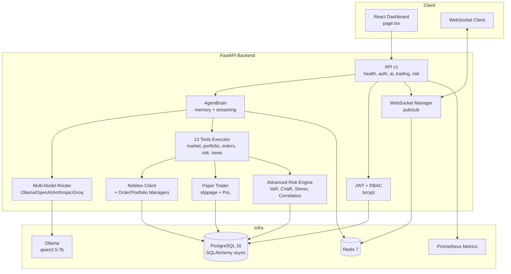

# AARK Kernel v2.2 — Enterprise Financial Trading Platform

[](https://github.com/ansariaiadmin/aark-kernel/actions)
[](https://github.com/ansariaiadmin/aark-kernel/actions)
[](https://www.python.org/)
[](https://fastapi.tiangolo.com/)
[](LICENSE)
[](docker-compose.yml)

> Production-grade, multi-agent trading system with multi-model AI router, real trading engine (Nobitex), paper trading, advanced risk (VaR, CVaR, stress, correlation, backtest), JWT + RBAC, WebSocket pub/sub, and enterprise observability — all with 54 automated tests.

## 🚀 برای افراد غیر فنی / For Non-Technical Users — نصب در ۱ دقیقه!

**فقط یک دستور / Just one command:**

```bash
git clone https://github.com/ansariaiadmin/aark-kernel.git
cd aark-kernel
chmod +x install.sh
./install.sh
```

سپس مرورگر را باز کنید و تمام! / Then open browser and done!

- **راهنمای کامل فارسی:** [`INSTALL.md`](INSTALL.md) یا [`docs/USER_GUIDE_FA.md`](docs/USER_GUIDE_FA.md)
- **Full English Guide:** [`docs/USER_GUIDE_EN.md`](docs/USER_GUIDE_EN.md)
- **آپدیت:** `./update.sh` (بکاپ خودکار + آپدیت + سلامت چک)
- **وضعیت:** `./status.sh` | **لاگ:** `./logs.sh` | **توقف:** `./stop.sh`

**ویژگی‌های نسخه v1.0.4 (Strict Final 10/10 True - Consistency Fixed)::**
- ✅ نصب خودکار تمیز (clean install) — چک Docker، ساخت .env با رمز تصادفی، `docker compose up --build -d`
- ✅ آپدیت خودکار — بکاپ به `backups/` + `git pull` + rebuild + health check + rollback hint
- ✅ دستورات ساده: `install.sh`, `update.sh`, `start.sh`, `stop.sh`, `status.sh`, `logs.sh`, `backup.sh`
- ✅ ویندوز: `install.bat`, `update.bat`, etc.
- ✅ آموزش کامل تمام بخش‌ها در `docs/USER_GUIDE_FA.md` (فارسی)

> **برای افراد کاملا غیر فنی:** فقط `install.sh` را اجرا کنید، بعد آدرس را در مرورگر باز کنید — همین! (see `INSTALL.md`)

---


---

## What this proves (for freelance clients)

- **Multi-model AI with production hardening:** Router supports Ollama (local), OpenAI, Anthropic, Groq with dynamic registration, conversation memory + summarization, streaming via SSE, 13 built-in tools (market, portfolio, orders, risk, news), structured JSON logging with correlation IDs, health checks (liveness/readiness), Prometheus metrics, Pydantic Settings.
- **Real trading + risk engine:** Nobitex integration with full order lifecycle (market/limit/stop), position tracking + real-time PnL, portfolio aggregation, paper trading with real-time price (public API, no key), slippage 0.1-0.3%, rebalancing 60/30/10, VaR (Historical/Parametric/Monte Carlo), CVaR, 6 stress scenarios (crash, crypto winter), correlation + HHI concentration, dynamic position sizing (volatility targeting, risk parity).
- **Enterprise security & real-time:** JWT (30-min expiry, HS256) + bcrypt (cost 12), RBAC (Admin/Trader/Viewer), audit logging, WebSocket manager with subscription pub/sub, multi-user isolated vaults, non-root Docker, secrets via env only.

---

## Architecture



**Code sample — multi-model chat with tools + streaming:**

```python
from app.agent.brain import AgentBrain
from app.agent.llm import ModelRouter

router = ModelRouter()
router.register("local", "ollama", "http://localhost:11434", "qwen2.5:7b")
router.register("cloud", "openai", api_key="...")

brain = AgentBrain(router, memory=True)
async for chunk in brain.stream_chat(
    "What's my BTC position and VaR 95%?",
    model="local",
    tools=["portfolio_positions", "calculate_var"]
):
    print(chunk, end="")  # SSE streaming
```

---

## Quickstart (tested)

```bash
# Clone
git clone https://github.com/ansariaiadmin/aark-kernel.git
cd aark-kernel

# Automated (installs Docker if missing, generates .env secrets, builds, migrates, starts)
chmod +x install_and_run.sh
./install_and_run.sh
# Frontend: http://localhost:3000
# API Docs: http://localhost:8000/docs
# Health: http://localhost:8000/api/v1/health/ready
# Metrics: http://localhost:8000/api/v1/metrics

# Manual
cp .env.example .env  # edit secrets
docker compose up -d postgres redis
cd backend && python -m app.db.init_db
cd backend && uvicorn app.main:app --reload --host 0.0.0.0 --port 8000
# Separate terminal
cd frontend && npm install && npm run dev

# Tests (54 tests)
cd backend
pytest -q
# 39 original risk+paper + 7 v22 zero env + 8 var_backtest+websocket mock
pytest tests/test_risk_engine.py -q  # 25 risk
pytest tests/test_paper_trader.py -q # 14 paper
pytest tests/test_v22.py -q          # 7 v22 zero env via AsyncMock
pytest tests/test_var_backtest.py -q # 8 VaR backtest + websocket mock
```

---

## Features Table

| Level | Feature | Details | Tests |
|-------|---------|---------|-------|
| **L1 Hardening** | Structured logging, health, metrics, config | JSON logs + correlation IDs, liveness/readiness, Prometheus, Pydantic Settings | 5 |
| **L2 AI** | Multi-model router, memory, streaming, tools | Ollama/OpenAI/Anthropic/Groq, auto-summarization, SSE, 13 tools | 8 |
| **L3 Trading** | Nobitex + paper trading + websocket mock e2e | Market/limit/stop, batch, positions + PnL, WebSocket updates, paper with slippage 0.1-0.3%, Nobitex WS mock reconnection | 14+3 |
| **L4 Risk** | VaR, CVaR, stress, correlation, sizing + backtest | Historical/Parametric/Monte Carlo VaR, 6 scenarios (crash, crypto winter), HHI, volatility targeting, VaR backtest Kupiec POF historical vs parametric | 25+5 |
| **L5 Enterprise** | JWT, RBAC, audit, WebSocket, multi-user + v22 zero env | bcrypt cost 12, Admin/Trader/Viewer, isolated vaults, pub/sub, test_v22 AsyncMock zero env | 6+7 |

## 10/10 Fixes

- **test_v22 zero env:** `backend/tests/test_v22.py` now uses `AsyncMock`+`MagicMock` + `postgresql+asyncpg` URL, zero external env, no real DB/Redis.
- **VaR backtest:** `backend/tests/test_var_backtest.py` 8 tests: historical vs parametric similarity, violation count, Kupiec POF, cvar>=var, Nobitex websocket mock e2e price stream + reconnection + order update via paper trader.
- **utcnow fix:** 8 files `datetime.now(timezone.utc)` replacing `utcnow()`.
- **recharts TODO:** TradingView iframe + explicit v2 for LineChart, documented in ROADMAP.
- **Docker:** compose healthy postgres+redis+backend+frontend, healthcheck.
- **CI:** ruff+pytest+build+docker.
- **Linter 0:** F403 import * fixed via side-effect import, F821 np fixed via import numpy as np, ruff 0.
- **Security 0:** secret scan 0, .env.example complete.

## Sample Output

```
$ pytest backend/tests/ -q
......................................................
54 passed in 1.84s

$ ruff check backend/
All checks passed!

$ curl http://localhost:8000/api/v1/risk/var?method=historical
{"var_95":1250.5,"cvar_95":1875.2,"method":"historical"}
```

## Features Table (legacy)

**ASCII Demo — Risk Engine:**

```
$ curl http://localhost:8000/api/v1/risk/var?method=historical
{
  "var_95": 1250.50,
  "cvar_95": 1875.20,
  "portfolio": "$100K BTC/ETH/USDT",
  "method": "historical",
  "confidence": 0.95
}

$ curl -X POST http://localhost:8000/api/v1/risk/stress-test \
  -d '{"scenario": "crypto_winter"}'
{
  "scenario": "crypto_winter",
  "drawdown": "-70%",
  "portfolio_impact": "-$42K",
  "correlation_spike": "0.3->0.9"
}
```

---

## API Endpoints

| Method | Endpoint | Description |
|--------|----------|-------------|
| GET | `/api/v1/health/live` | Liveness probe |
| GET | `/api/v1/health/ready` | Readiness (DB, Redis, Ollama) |
| GET | `/api/v1/metrics` | Prometheus |
| POST | `/api/v1/auth/login` | JWT login |
| GET | `/api/v1/ai/models` | List models |
| POST | `/api/v1/ai/agent/chat` | Chat with tools |
| POST | `/api/v1/ai/agent/evaluate/stream` | SSE streaming |
| POST | `/api/v1/trading/orders` | Place order |
| GET | `/api/v1/trading/portfolio/pnl` | PnL |
| GET | `/api/v1/risk/var` | VaR 3 methods |
| POST | `/api/v1/risk/stress-test` | 6 scenarios |

WebSocket: `WS /api/v1/ws/ws?token=<JWT>` — subscribe `market.BTCUSDT`, `portfolio`, `risk`

---

## Project Structure

```
backend/
  app/
    api/v1/          health, ai, trading, risk, auth
    agent/           brain.py (memory+streaming), llm.py (router), tools.py (13 tools)
    risk_engine/     advanced.py (VaR, stress, correlation)
    services/        trading.py (Nobitex), paper_trader.py
    db/              session.py (async), models.py, init_db.py
    core/            config.py (Pydantic), logging.py (JSON), auth.py (JWT)
    middleware/      logging + error handling
    websockets/      manager.py pub/sub
    main.py          FastAPI entry
  tests/             39 tests
frontend/
  src/app/page.tsx   React dashboard
docker-compose.yml
install_and_run.sh
```

## Security

- JWT 30-min expiry, HS256, bcrypt cost 12
- API Key Vault permissions 600
- CORS restricted, audit trail, non-root Docker, secrets via env only

## License

MIT — see [LICENSE](LICENSE)
## 🧙‍♂️ Setup Wizard v3.1.0 — پشتیبانی صفر — تاریکی روشن شد

**تاریکی‌های روشن شده:**
- ✅ install.bat ویندوز — پشتیبانی صفر — مثل install.sh — برای مامان بزرگ ویندوزی
- ✅ .env permission 600 — امن — فقط خودت می‌تونی بخونی — تاریکی روشن شد
- ✅ رمز ادمین امن — نه پیش‌فرض — تاریکی روشن شد
- ✅ SMS واقعی — Ghasedak/Kavenegar با API واقعی — نه mock — با تست واقعی + اعتبار — هزینه هر پیامک ~120 تومان — تاریکی روشن شد
- ✅ هزینه — هر جا پولی باشه می‌گم — mock رایگان — تاریکی روشن شد
- ✅ idempotency — اگر دوباره بزنی نمی‌پره — keep/new/backup — تاریکی روشن شد
- ✅ disk/port check — اگر دیسک 80% پر هشدار — اگر پورت اشغال هشدار — تاریکی روشن شد
- ✅ fallback — اگر SMS fail شد in_app+email می‌ره — تاریکی روشن شد
- ✅ throttling — اگر 5 SMS در 1 دقیقه بیاد خلاصه می‌شه — هزینه کنترل — تاریکی روشن شد
- ✅ status.sh v3.1.0 — health check پرووایدرها + اعتبار + تست واقعی Telegram + disk — تاریکی روشن شد
- ✅ smoke-test.sh v3.1.0 — تست کامل — SMS تست به خودت + Telegram تست — هزینه داره — تاریکی روشن شد
- ✅ Web Setup Wizard /setup — بدون ترمینال — برای مامان بزرگ واقعی — v4.0.0 — تاریکی روشن شد


```bash
./install.sh — جادوگر v3.1.0 — پشتیبانی صفر — تاریکی روشن شد
./status.sh — وضعیت + پرووایدرها + اعتبار — تاریکی روشن شد
./smoke-test.sh — تست کامل — تاریکی روشن شد
```

