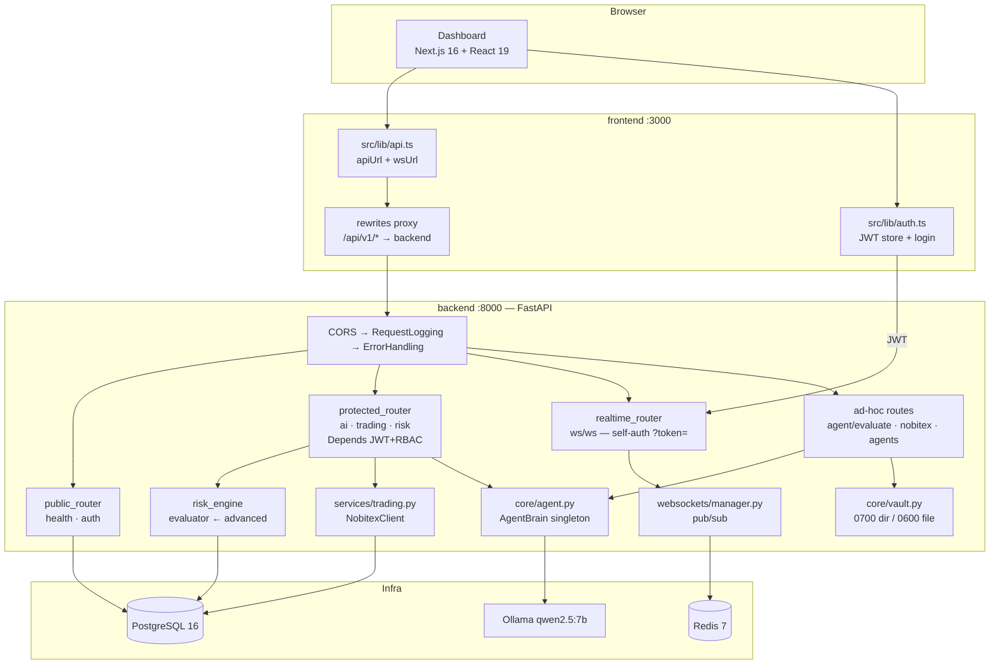

# AARK Kernel — Enterprise Financial Trading Platform

[](https://github.com/ansariaiadmin/aark-kernel/actions)


[](https://www.python.org/)
[](https://fastapi.tiangolo.com/)
[](https://nextjs.org/)
[](LICENSE)
[](docker-compose.yml)

**نسخهٔ 3.3.0** — فاز ۰ (یکپارچگی ساخت و سیم‌کشی) بسته شد.

> پلتفرم معاملاتی با موتور ریسک پیشرفته (VaR/CVaR/stress/correlation)،
> احراز هویت JWT + RBAC، WebSocket بلادرنگ، یکپارچگی با نوبیتکس، و داشبورد Next.js.
> **۳۹ روت زنده · ۱۰۹ تست · lint/typecheck/build صفر خطا.**

---

## 📢 صداقت دربارهٔ وضعیت پروژه

این README در نسخهٔ 3.3.0 بازنویسی شد، چون نسخهٔ قبلی چیزهایی را تبلیغ می‌کرد
که در کد وجود نداشت. ممیزی کامل در [`docs/AUDIT.md`](docs/AUDIT.md) است.

**قاعدهٔ این فایل:** هر ادعا یا یک تست پشتش است، یا یک دستور که خودتان می‌توانید اجرا کنید.

| ✅ واقعاً کار می‌کند (تست‌شده) | ⚠️ هنوز کامل نیست (در ROADMAP ثبت شده) |
|---|---|
| موتور ریسک: VaR سه روش، CVaR، ۶ سناریوی stress، correlation + HHI، position sizing | ۱۳ ابزار ایجنت هنوز **stub** هستند |
| احراز هویت: bcrypt، JWT ۳۰ دقیقه‌ای، RBAC، audit log | `/risk/var` دادهٔ **تصادفی** برمی‌گرداند، نه بازار واقعی |
| Paper trader: slippage، limit/stop، PnL، rebalance (۲۲ تست) | `paper_trader` هنوز به **اپ** وصل نیست (فقط تست) |
| WebSocket pub/sub با احراز هویت توکن | `notification` و `sms` ماژول‌های **یتیم** هستند |
| یکپارچگی نوبیتکس: order lifecycle، balances، positions | `robots/intelligence/` یتیم کامل است |
| ۳۹ روت زنده، همه مستند و هم‌راستا با OpenAPI | PWA manifest به آیکون‌های ناموجود ارجاع می‌دهد |
| داشبورد Next.js با ورود واقعی، تب‌ها، Kill Switch | مهاجرت DB دستی است (Alembic ندارد) |

---

## 🚀 نصب سریع

### خودکار (پیشنهادی)

```bash
git clone https://github.com/ansariaiadmin/aark-kernel.git
cd aark-kernel
chmod +x install.sh
./install.sh
```

جادوگر نصب از شما ایمیل و رمز ادمین را می‌پرسد، `.env` را با رمز تصادفی می‌سازد،
و کانتینرها را بالا می‌آورد. **از نسخهٔ 3.3.0 آن ادمین واقعاً در دیتابیس ساخته می‌شود**
و می‌توانید وارد شوید — قبلاً هیچ راهی برای ورود وجود نداشت.

### دستی

```bash
cp .env.example .env            # رمزها را عوض کنید
docker compose up -d postgres redis
cd backend && pip install -r requirements-dev.txt
python -m app.db.init_db        # جدول‌ها + ساخت ادمین از ADMIN_EMAIL/ADMIN_PASSWORD
uvicorn app.main:app --reload --host 0.0.0.0 --port 8000
```

ترمینال دوم:

```bash
cd frontend && npm ci && npm run dev
```

### آدرس‌ها

| سرویس | نشانی |
|---|---|
| داشبورد | http://localhost:3000 |
| سلامت | http://localhost:8000/api/v1/health/live |
| آمادگی (DB + Redis + Ollama) | http://localhost:8000/api/v1/health/ready |
| مستندات API | http://localhost:8000/docs *(نیاز به `DEBUG=true`)* |
| متریک‌ها | http://localhost:8000/api/v1/metrics |

---

## ✅ بررسی سلامت (هر سه را خودتان اجرا کنید)

```bash
# بک‌اند — lint + تست
cd backend
ruff check .                                   # All checks passed!
pytest tests/ -q                               # 109 passed
python -c "from app.main import app; print(len(app.openapi()['paths']))"   # 39

# فرانت — lint + type + build
cd frontend
npm run verify                                 # eslint ✓  tsc ✓  next build ✓

# زنجیرهٔ زندهٔ کامل
docker compose config -q && docker compose build
```

### نمونهٔ خروجی واقعی زنجیرهٔ زنده

```
GET  :3000/                                → 200   (داشبورد)
GET  :3000/api/v1/health/live              → {"status":"alive"}      ← پروکسی Next
POST :3000/api/v1/auth/login               → JWT صادر شد (184 کاراکتر)
GET  :3000/api/v1/auth/me                  → {"id":1,"role":"admin","is_superuser":true}
GET  :3000/api/v1/risk/summary  (بی‌توکن)   → 401
GET  :3000/api/v1/risk/summary  (با توکن)   → 200
```

---

## 🏗 معماری


```mermaid
flowchart TB
    subgraph Browser
        UI[Dashboard<br/>Next.js 16 + React 19]
    end

    subgraph FE[frontend :3000]
        API_LIB[src/lib/api.ts<br/>apiUrl + wsUrl]
        AUTH_LIB[src/lib/auth.ts<br/>JWT store + login]
        RW[rewrites proxy<br/>/api/v1/* → backend]
    end

    subgraph BE[backend :8000 — FastAPI]
        MW[CORS → RequestLogging → ErrorHandling]
        PUB[public_router<br/>health · auth]
        PROT[protected_router<br/>ai · trading · risk<br/>Depends JWT+RBAC]
        RT[realtime_router<br/>ws/ws — self-auth ?token=]
        ADHOC[ad-hoc routes<br/>agent/evaluate · nobitex · agents]
        BRAIN[core/agent.py<br/>AgentBrain singleton]
        VAULT[core/vault.py<br/>0700 dir / 0600 file]
        RISK[risk_engine<br/>evaluator ← advanced]
        TRADING[services/trading.py<br/>NobitexClient]
        WSM[websockets/manager.py<br/>pub/sub]
    end

    subgraph Infra
        PG[(PostgreSQL 16)]
        RD[(Redis 7)]
        OL[Ollama qwen2.5:7b]
    end

    UI --> API_LIB & AUTH_LIB
    API_LIB --> RW --> MW
    AUTH_LIB -->|JWT| RT
    MW --> PUB & PROT & RT & ADHOC
    PROT --> RISK & TRADING & BRAIN
    ADHOC --> BRAIN & VAULT
    RT --> WSM
    PUB --> PG
    RISK --> PG
    TRADING --> PG
    BRAIN --> OL
    WSM --> RD
```

### سه لایهٔ دسترسی

روت‌ها بر اساس **وضعیت احراز هویت** تفکیک شده‌اند (در `app/api/v1/__init__.py`):

| روتر | محتوا | احراز هویت |
|---|---|---|
| `public_router` | `health/*`, `metrics`, `auth/login`, `auth/register` | بدون توکن |
| `protected_router` | `ai/*`, `trading/*`, `risk/*` | `Depends(get_current_active_user)` |
| `realtime_router` | `ws/ws` | خودش `?token=` را در handshake اعتبارسنجی می‌کند |

> WebSocket نمی‌تواند از `OAuth2PasswordBearer` استفاده کند (هدر در درخواست
> upgrade قابل تنظیم نیست)، پس جدا mount می‌شود.

---

## 🔌 اندپوینت‌ها

این جدول از `app.openapi()` **تولید** شده و با تست `test_every_documented_endpoint_is_mounted` قفل شده است.

### عمومی

| متد | مسیر | توضیح |
|---|---|---|
| GET | `/api/v1/health` | وضعیت کلی + نسخه |
| GET | `/api/v1/health/live` | liveness probe |
| GET | `/api/v1/health/ready` | readiness (DB, Redis, Ollama) |
| GET | `/api/v1/metrics` | Prometheus |
| POST | `/api/v1/auth/login` | ورود (OAuth2 form) → JWT |
| GET | `/api/v1/nobitex/status` | وضعیت والت صرافی |
| GET | `/api/v1/agents` | فهرست ایجنت‌های ثبت‌شده |

### محافظت‌شده (Bearer JWT)

| متد | مسیر | توضیح |
|---|---|---|
| POST | `/api/v1/auth/register` | ساخت کاربر *(فقط ADMIN)* |
| GET/PATCH | `/api/v1/auth/me` | پروفایل جاری |
| GET | `/api/v1/auth/users` | فهرست کاربران *(فقط ADMIN)* |
| GET/PATCH/DELETE | `/api/v1/auth/users/{id}` | مدیریت کاربر *(فقط ADMIN)* |
| GET | `/api/v1/trading/portfolio/balances` | موجودی‌ها |
| GET | `/api/v1/trading/portfolio/positions` | پوزیشن‌ها |
| GET | `/api/v1/trading/portfolio/pnl` | خلاصهٔ سود/زیان |
| GET | `/api/v1/trading/portfolio/value` | ارزش کل به IRT |
| POST/GET | `/api/v1/trading/orders` | ثبت / فهرست سفارش |
| GET/DELETE | `/api/v1/trading/orders/{id}` | وضعیت / لغو سفارش |
| POST | `/api/v1/trading/orders/batch` | ثبت دسته‌ای |
| GET | `/api/v1/risk/var` | VaR (historical / parametric / monte_carlo) |
| POST | `/api/v1/risk/stress-test` | ۶ سناریوی استرس |
| GET | `/api/v1/risk/correlation` | همبستگی + HHI |
| POST | `/api/v1/risk/validate` | اعتبارسنجی کامل پورتفولیو |
| POST | `/api/v1/risk/position-size` | سایز پوزیشن پویا |
| GET | `/api/v1/risk/summary` | پیکربندی و وضعیت موتور ریسک |
| GET | `/api/v1/ai/models` | مدل‌های ثبت‌شده |
| POST | `/api/v1/ai/models/register` | ثبت مدل جدید |
| POST | `/api/v1/ai/agent/chat` | گفت‌وگو |
| POST | `/api/v1/ai/agent/evaluate/stream` | SSE streaming |
| GET | `/api/v1/ai/tools` | فهرست ابزارها |
| WebSocket | `/api/v1/ws/ws?token=JWT` | `market.<SYMBOL>`, `portfolio`, `risk` |

### نمونهٔ قابل اجرا

```bash
TOKEN=$(curl -s -X POST http://localhost:8000/api/v1/auth/login \
  -H 'Content-Type: application/x-www-form-urlencoded' \
  -d 'username=admin@aark-kernel.dev&password=<ADMIN_PASSWORD>' \
  | python3 -c 'import sys,json;print(json.load(sys.stdin)["access_token"])')

# VaR — توجه: portfolio_value الزامی است
curl -s "http://localhost:8000/api/v1/risk/var?method=historical&portfolio_value=100000" \
  -H "Authorization: Bearer $TOKEN"

# استرس‌تست — هر چهار فیلد در یک JSON body
curl -s -X POST http://localhost:8000/api/v1/risk/validate \
  -H "Authorization: Bearer $TOKEN" -H 'Content-Type: application/json' \
  -d '{"positions":{"BTCUSDT":1.0},"prices":{"BTCUSDT":60000},"daily_pnl":0,"portfolio_value":100000}'
```

---

## 🧪 تست‌ها

| فایل | تعداد | پوشش |
|---|---|---|
| `test_api_wiring.py` | 39 | mount بودن روت‌ها، bcrypt→JWT→DB واقعی، 401/403، CORS، قرارداد body، vault 0600/0700، bootstrap ادمین |
| `test_release_consistency.py` | 16 | یکسانی ورژن، تازگی `docs/API.md`، پوشش `.env.example` |
| `test_risk_engine.py` | 25 | VaR سه روش، CVaR، ۶ سناریو، correlation، HHI، sizing |
| `test_nobitex_paper_trading.py` | 14 | market/limit/stop، slippage، PnL، rebalance |
| `test_var_backtest.py` | 8 | Kupiec POF، mock WebSocket |
| `test_v22.py` | 7 | مسیر ایجنت + سقف ریسک ۲۰٪ |
| **مجموع** | **109** | |

تست‌های جدید به **هیچ سرویس خارجی** نیاز ندارند — SQLite واقعی و `ASGITransport`،
بدون mock در مرز HTTP. این عمدی است: mock کردن همان چیزی بود که اجازه داد
۲۳ اندپوینت گم‌شده و هش شکستهٔ bcrypt مدت‌ها پنهان بمانند.

```bash
cd backend && pytest tests/ -q
```

---

## 🔐 امنیت

- **bcrypt مستقیم** (cost 12) — passlib حذف شد چون با `bcrypt>=4.1` می‌شکست
- **JWT HS256** با انقضای ۳۰ دقیقه، claimهای `sub`/`iat`/`exp`/`role`
- **RBAC**: Admin / Trader / Viewer + `is_superuser`
- **والیت کلید صرافی**: پوشه `0700`، فایل `0600`، نوشتن اتمیک، بیرون از دیتابیس
- **CORS** محدود به `BACKEND_CORS_ORIGINS`
- **Audit log** برای ورود موفق/ناموفق و همهٔ تغییرات کاربر
- **کانتینر non-root** (`appuser` 1001، `nextjs` 1001)
- **بدون رمز پیش‌فرض**: `API_SECRET_KEY` با `min_length=32` اجباری است
- **bootstrap ادمین** رمز کوتاه‌تر از ۱۲ کاراکتر را رد می‌کند

⚠️ **شناخته‌شده و ثبت‌شده در ROADMAP فاز ۱:** روت‌های ad-hoc در `main.py`
(از جمله `POST /api/v1/nobitex/save-key`) هنوز بدون احراز هویت هستند.
تا زمان بسته‌شدن فاز ۱، بک‌اند را فقط پشت reverse proxy با احراز هویت
یا روی `127.0.0.1` در معرض شبکه قرار دهید (`docker-compose.yml` به‌طور
پیش‌فرض همین کار را می‌کند).

---

## 🗺 نقشهٔ راه

جزئیات کامل و تسک‌به‌تسک در [`ROADMAP.md`](ROADMAP.md).

| فاز | هدف | وضعیت |
|---|---|---|
| **۰** | یکپارچگی ساخت و سیم‌کشی | ✅ **بسته شد — v3.3.0** |
| **۱** | صحت مستندات + سخت‌سازی امنیتی | 🔜 v3.4.0 |
| **۲** | واقعی‌سازی لایهٔ داده و ایجنت | 📋 v3.5.0 |
| **۳** | بلوغ محصول و عملیات (PWA، Wizard، چارت واقعی) | 📋 v4.0.0 |

هر فاز با یک **دروازهٔ انتشار** بسته می‌شود؛ تا سبز نشدن آن، ورژن bump نمی‌شود.

---

## 📁 ساختار پروژه

```
backend/app/
  main.py               نقطهٔ ورود + lifespan + روت‌های ad-hoc
  api/v1/               __init__ (public/protected/realtime) · ai · auth · health · risk · trading
  core/                 config · auth · logging · agent (brain singleton) · vault
  agent/                brain · llm (ModelRouter) · tools · registry
  risk_engine/          advanced (VaR/stress) · evaluator (منبع حقیقت محدودیت‌ها)
  services/             trading (Nobitex) · paper_trader · notification/ · sms/
  db/                   session · models (۷ جدول) · init_db (+ bootstrap_admin)
  middleware/           logging + error handling
  websockets/           manager (pub/sub)
frontend/src/
  app/                  layout.tsx · page.tsx · globals.css
  components/           LineChart · OrderBook
  lib/                  api.ts (apiUrl/wsUrl) · auth.ts (JWT store)
```

---

## 🛠 دستورات روزانه

| دستور | کار |
|---|---|
| `./install.sh` | نصب کامل + ساخت `.env` + بالا آوردن کانتینرها |
| `./update.sh` | بکاپ خودکار + `git pull` + rebuild + health check |
| `./status.sh` | وضعیت سرویس‌ها |
| `./logs.sh` | لاگ زنده |
| `./backup.sh` | بکاپ (نگه‌داشتن ۷ نسخهٔ آخر) |
| `./stop.sh` | توقف |
| `./smoke-test.sh` | تست زنجیرهٔ کامل |

نسخهٔ ویندوز: `install.bat`, `update.bat`, `start.bat`, `stop.bat`, `status.bat`, `logs.bat`, `backup.bat`

---

## 📚 مستندات

| فایل | محتوا |
|---|---|
| [`docs/AUDIT.md`](docs/AUDIT.md) | ممیزی ابعادی کامل درخت و سیم‌کشی — ۴۵ یافته با شاهد |
| [`ROADMAP.md`](ROADMAP.md) | تسک‌بندی فازها + دروازه‌های انتشار |
| [`CHANGELOG.md`](CHANGELOG.md) | تاریخچهٔ تغییرات |
| [`ARCHITECTURE.md`](ARCHITECTURE.md) | معماری و اتصالات |
| [`INSTALL.md`](INSTALL.md) | راهنمای نصب فارسی |
| [`docs/USER_GUIDE_FA.md`](docs/USER_GUIDE_FA.md) · [`docs/USER_GUIDE_EN.md`](docs/USER_GUIDE_EN.md) | راهنمای کاربر |
| [`SECURITY.md`](SECURITY.md) | سیاست امنیتی |
| [`CONTRIBUTING.md`](CONTRIBUTING.md) | راهنمای مشارکت |
| [`AGENTS.md`](AGENTS.md) | فهرست ایجنت‌ها |

---

## License

MIT — see [LICENSE](LICENSE)
