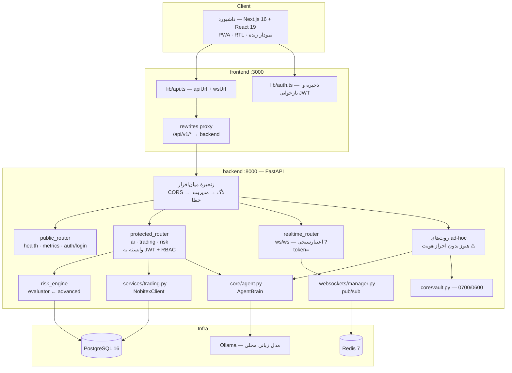

# AARK Kernel

### Trading & Risk Platform — Real-time market data, quantitative risk analytics, and secure key management

[](https://github.com/ansariaiadmin/aark-kernel/actions/workflows/ci.yml)
[](backend/tests)
[](CHANGELOG.md)
[](https://www.python.org/)
[](https://fastapi.tiangolo.com/)
[](https://nextjs.org/)
[](LICENSE)
[](docker-compose.yml)

**نسخهٔ فعلی: 3.3.0** — آخرین انتشار پایدار: [`CHANGELOG.md`](CHANGELOG.md)

---

## For International Reviewers & Investors

AARK Kernel is a self-hosted trading and risk-management platform built on FastAPI
and Next.js. It combines a deterministic risk engine (Value-at-Risk via three
independent methods, Expected Shortfall, stress testing, correlation and
concentration analysis), a live exchange integration for the Iranian market
(Nobitex), JWT authentication with role-based access control, real-time
WebSocket streaming, and a browser dashboard.

**Engineering status as of v3.3.0 (all figures independently verified in CI):**

| Metric | Value | Verification |
|---|---|---|
| Live API endpoints | 39 | Generated from `app.openapi()` |
| Automated tests | 109 passing | `pytest tests/ -q` |
| CI pipeline | 4/4 jobs green | [Actions](https://github.com/ansariaiadmin/aark-kernel/actions) |
| Lint / type / build | 0 errors | `ruff`, `tsc --noEmit`, `next build` |
| Container users | non-root (uid 1001) | `backend/Dockerfile`, `frontend/Dockerfile` |

**Honest scope statement.** The platform is production-grade for *authentication,
risk analytics, market data, portfolio visibility and paper trading*. A small
number of routes remain unauthenticated and several subsystems are not yet wired
into the product. Both categories are tracked explicitly with task IDs in
[`ROADMAP.md`](ROADMAP.md) rather than described as complete. We prefer a
documented gap to an undocumented one.

---

## برای کاربران غیرفنی: این پروژه چه کاری برای شما می‌کند؟

تصور کنید یک **داشبورد حرفه‌ای** دارید که هر چند ثانیه قیمت‌های بازار را نشان
می‌دهد، به شما می‌گوید «اگر فردا بازار ۲۰٪ بیفتد، چقدر ضرر می‌کنید»، و اگر تصمیم
به خرید یا فروش گرفتید، سفارش را با یک کلیک ثبت می‌کند.

AARK Kernel دقیقاً همین است. سه بخش اصلی دارد:

| بخش | به زبان ساده | وضعیت در نسخهٔ 3.3.0 |
|---|---|---|
| **موتور ریسک** | قبل از اینکه پول در خطر کنید، می‌گوید چقدر در معرض خطرید | ✅ کامل و تست‌شده |
| **داشبورد زنده** | قیمت‌ها، موجودی‌ها، سود و زیان — همه در یک صفحه | ✅ کار می‌کند |
| **کیف امن کلیدها** | کلید API صرافی‌تان مثل پول نقد، در گاوصندوق قفل می‌شود | ✅ کار می‌کند |

**نکتهٔ اطمینان:** برای شروع به هیچ دانش فنی‌ای نیاز ندارید. یک دستور نصب
وجود دارد که همه‌چیز را خودش انجام می‌دهد — توضیح گام‌به‌گام در
[`docs/USER_GUIDE_FA.md`](docs/USER_GUIDE_FA.md).

---

## truthful — چه چیزی واقعاً کار می‌کند

این بخش عمداً اول آمده. در نسخهٔ 3.3.0 کل README بازنویسی شد، چون نسخهٔ قبلی
چیزهایی را ادعا می‌کرد که در کد وجود نداشت. قاعدهٔ این فایل ساده است:

> **هر ادعا یا پشتش یک تست خودکار است، یا یک دستوری که خودتان می‌توانید اجرا کنید.**

### ✅ آزمایش‌شده و کارآمد

| قابلیت | شاهد |
|---|---|
| احراز هویت: bcrypt (cost 12)، JWT با انقضای ۳۰ دقیقه، RBAC سه‌نقشی، audit log | ۳۹ تست سیم‌کشی |
| موتور ریسک: VaR با سه روش مستقل (historical / parametric / Monte Carlo)، CVaR، ۶ سناریوی استرس، همبستگی، شاخص تمرکز HHI، سایزپوزیشن پویا | ۲۵ تست |
| معاملات آزمایشی (Paper Trading): slippage، سفارش limit/stop، محاسبهٔ PnL، توازن‌سازی مجدد | ۱۴ تست |
| اعتبارسنجی backtest آماری: آزمون Kupiec POF | ۸ تست |
| یکپارچگی Nobitex: چرخهٔ کامل سفارش، موجودی، پوزیشن، قیمت لحظه‌ای | `services/trading.py` |
| WebSocket با احراز هویت توکن و pub/sub موضوعی | `websockets/manager.py` |
| داشبورد Next.js: ورود واقعی، تب‌ها، کلید قطع اضطراری، نمودار، دفتر سفارشات | `frontend/src/app/page.tsx` |
| کیف امن کلید صرافی: پوشهٔ `0700`، فایل `0600`، نوشتن اتمیک، بیرون از دیتابیس | تست مجوزها |
| PWA: manifest و آیکون‌های ۱۹۲/۵۱۲ فعال و لینک‌شده | `frontend/public/` |
| ۳۹ اندپوینت، هم‌راستا با OpenAPI | تولید خودکار از `app.openapi()` |

### ⚠️ شناخته‌شده و ثبت‌شده (نه پنهان)

| وضعیت | جزئیات | پیگیری |
|---|---|---|
| ۷ مسیر تجاری بدون احراز هویت | `agent/evaluate`، `agents/*`، `nobitex/save-key`، `nobitex/key`، `integrations/accounting/sync` | [`ROADMAP.md`](ROADMAP.md) فاز ۱ |
| `/risk/var` دادهٔ تصادفی برمی‌گرداند | موتور درست است، ولی منبع دادهٔ بازار واقعی وصل نیست | فاز ۲ |
| ۱۳ ابزار ایجنت هنوز stub هستند | `agent/tools.py` امضاها را دارد، منطق خالی است | فاز ۲ |
| `paper_trader` به اپ وصل نیست | فقط در تست‌ها استفاده می‌شود | فاز ۲ |
| `notification/` و `sms/` یتیمند | کد دارند، هیچ‌جا صدا زده نمی‌شوند | فاز ۲ |
| مهاجرت دیتابیس دستی است | Alembic ندارد؛ `init_db.py` جدول می‌سازد | فاز ۳ |

> **هشدار امنیتی برای استقرار:** تا بسته‌شدن فاز ۱، بک‌اند را فقط پشت یک
> reverse proxy با احراز هویت یا روی `127.0.0.1` قرار دهید. پیکربندی
> پیش‌فرض `docker-compose.yml` همین کار را می‌کند.

---

## نصب گام‌به‌گام

### پیش‌نیاز

| چه چیزی | چه مقدار | چطور بگیرم |
|---|---|---|
| Docker Desktop | ۲۴ یا بالاتر | [docs.docker.com/get-docker](https://docs.docker.com/get-docker/) |
| Git | هر نسخهٔ اخیر | [git-scm.com](https://git-scm.com/downloads) |
| RAM آزاد | حداقل ۴ گیگابایت | — |
| پورت آزاد | ۳۰۰۰ و ۸۰۰۰ | — |

> اختیاری: برای تحلیل هوشمند با مدل زبانی محلی،
> [Ollama](https://ollama.com/) را نصب و مدل `qwen2.5:7b` را دریافت کنید.
> بدون آن، همه‌چیز جز گفت‌وگو با ایجنت کار می‌کند.

### گام ۱ — دریافت کد

```bash
git clone https://github.com/ansariaiadmin/aark-kernel.git
cd aark-kernel
```

### گام ۲ — اجرای جادوگر نصب

```bash
chmod +x install.sh
./install.sh
```

جادوگر از شما می‌پرسد و خودش انجام می‌دهد:

1. ایمیل و رمز ادمین — رمز باید حداقل ۱۲ کاراکتر باشد
2. ساخت `.env` با رمزهای تصادفی ۳۲ کاراکتری
3. بررسی سلامت Docker
4. بالا آوردن PostgreSQL، Redis، بک‌اند و فرانت
5. **ساخت واقعی حساب ادمین در دیتابیس** — بدون این، هیچ راهی برای ورود نبود

### گام ۳ — ورود

مرورگر را باز کنید: **<http://localhost:3000>**

با همان ایمیلی که در گام ۲ دادید وارد شوید.

### اگر مشکلی پیش آمد

```bash
./logs.sh backend        # لاگ بک‌اند
./status.sh              # وضعیت هر سرویس
./smoke-test.sh          # تست خودکار زنجیرهٔ کامل
```

راهنمای عیب‌یابی کامل: [`docs/USER_GUIDE_FA.md`](docs/USER_GUIDE_FA.md#عیب‌یابی)

---

## راستی‌آزمایی مستقل — خودتان بررسی کنید

هیچ‌کدام از اعداد بالا را از ما قبول نکنید. این‌ها را اجرا کنید:

```bash
# ۱. بک‌اند — lint و تست
cd backend
ruff check .                    # → All checks passed!
pytest tests/ -q                # → 109 passed
python -c "from app.main import app; print(len(app.openapi()['paths']))"   # → 39

# ۲. فرانت — lint، نوع‌سازی و build
cd ../frontend
npm run verify                  # → eslint ✓  tsc ✓  next build ✓

# ۳. صحت پیکربندی Docker
docker compose config -q && docker compose build
```

### زنجیرهٔ زندهٔ تأییدشده

خروجی واقعی اجرا روی همین مخزن (۲۰۲۶-۰۹-۲۷):

```
GET  :3000/                              → 200   داشبورد
GET  :3000/api/v1/health/live            → 200   از طریق پروکسی Next
POST :3000/api/v1/auth/login             → JWT صادر شد (۱۸۴ کاراکتر)
GET  :3000/api/v1/auth/me                → 200   {"id":1,"role":"admin"}
GET  :3000/api/v1/risk/summary  بی‌توکن   → 401   محافظت‌شده ✅
GET  :3000/api/v1/risk/summary  با توکن   → 200   دسترسی مجاز ✅
```

### CI

| Job | محتوا |
|---|---|
| **Backend** | `ruff check` → `pytest tests/` |
| **Frontend** | `npm ci` → `eslint` → `tsc --noEmit` → `next build` |
| **Docker** | ساخت `.env` از `.env.example` → `docker compose config` → نگهبان متغیرهای مستندنشده → `docker compose build` |
| **CI** | دروازهٔ تجمیعی برای branch protection |

> **پیش از v3.3.0 هیچ‌کدام از این jobها سبز نبود.** job داکر به‌طور خاص هرگز
> پاس نشده بود: همهٔ سرویس‌ها `env_file: - .env` داشتند ولی آن job فقط
> `checkout` می‌کرد و Compose v2 در نبود فایل با خطا خارج می‌شد. آخرین اجرای
> سبز: [run 36318052647](https://github.com/ansariaiadmin/aark-kernel/actions/runs/36318052647).

---

## معماری


```mermaid
flowchart TB
    subgraph Client
        UI["داشبورد — Next.js 16 + React 19<br/>PWA · RTL · نمودار زنده"]
    end

    subgraph Frontend["frontend :3000"]
        APILIB["lib/api.ts — apiUrl + wsUrl"]
        AUTHLIB["lib/auth.ts — ذخیره و بازخوانی JWT"]
        RW["rewrites proxy<br/>/api/v1/* → backend"]
    end

    subgraph Backend["backend :8000 — FastAPI"]
        MW["زنجیرهٔ میان‌افزار<br/>CORS → لاگ → مدیریت خطا"]
        PUB["public_router<br/>health · metrics · auth/login"]
        PROT["protected_router<br/>ai · trading · risk<br/>وابسته به JWT + RBAC"]
        RT["realtime_router<br/>ws/ws — اعتبارسنجی ?token="]
        ADHOC["روت‌های ad-hoc<br/>هنوز بدون احراز هویت ⚠"]
        BRAIN["core/agent.py — AgentBrain"]
        VAULT["core/vault.py — 0700/0600"]
        RISK["risk_engine<br/>evaluator ← advanced"]
        TRADING["services/trading.py — NobitexClient"]
        WSM["websockets/manager.py — pub/sub"]
    end

    subgraph Infra
        PG[("PostgreSQL 16")]
        RD[("Redis 7")]
        OL["Ollama — مدل زبانی محلی"]
    end

    UI --> APILIB & AUTHLIB
    APILIB --> RW --> MW
    MW --> PUB & PROT & RT & ADHOC
    PROT --> RISK & TRADING & BRAIN
    ADHOC --> BRAIN & VAULT
    RT --> WSM
    RISK --> PG
    TRADING --> PG
    BRAIN --> OL
    WSM --> RD
```

### سه لایهٔ دسترسی

| روتر | محتوا | احراز هویت |
|---|---|---|
| `public_router` | `health/*`، `metrics`، `auth/login` | بدون توکن — عمدی |
| `protected_router` | `ai/*`، `trading/*`، `risk/*` | `Depends(get_current_active_user)` |
| `realtime_router` | `ws/ws` | خودش `?token=` را در handshake بررسی می‌کند |
| *ad-hoc در `main.py`* | `agent/evaluate`، `agents/*`، `nobitex/*`، `integrations/*` | ⚠️ **بدون احراز هویت — فاز ۱** |

> WebSocket نمی‌تواند از هدر `Authorization` استفاده کند، چون هدر در درخواست
> upgrade قابل تنظیم نیست؛ به همین دلیل جدا mount می‌شود.

شرح کامل لایه‌ها و تصمیم‌های طراحی: [`ARCHITECTURE.md`](ARCHITECTURE.md)

---

## اندپوینت‌ها

این جدول از `app.openapi()` تولید شده و با تست
`test_every_documented_endpoint_is_mounted` قفل است. نسخهٔ کامل و تعاملی:
[`docs/API.md`](docs/API.md)

### عمومی — بدون توکن

| متد | مسیر | کار |
|---|---|---|
| GET | `/api/v1/health` | وضعیت کلی و نسخه |
| GET | `/api/v1/health/live` | liveness probe |
| GET | `/api/v1/health/ready` | readiness (DB، Redis، Ollama) |
| GET | `/api/v1/metrics` | متریک‌های Prometheus |
| POST | `/api/v1/auth/login` | ورود با فرم OAuth2 → JWT |

### محافظت‌شده — با `Authorization: Bearer <JWT>`

| متد | مسیر | کار |
|---|---|---|
| POST | `/api/v1/auth/register` | ساخت کاربر — **فقط ADMIN** |
| GET / PATCH | `/api/v1/auth/me` | پروفایل کاربر جاری |
| GET | `/api/v1/auth/users` | فهرست کاربران — **فقط ADMIN** |
| GET / PATCH / DELETE | `/api/v1/auth/users/{user_id}` | مدیریت کاربر — **فقط ADMIN** |
| GET | `/api/v1/trading/portfolio/balances` | موجودی‌ها |
| GET | `/api/v1/trading/portfolio/positions` | پوزیشن‌ها |
| GET | `/api/v1/trading/portfolio/pnl` | خلاصهٔ سود و زیان |
| GET | `/api/v1/trading/portfolio/value` | ارزش کل به ریال |
| POST / GET | `/api/v1/trading/orders` | ثبت / فهرست سفارش |
| GET / DELETE | `/api/v1/trading/orders/{order_id}` | وضعیت / لغو سفارش |
| POST | `/api/v1/trading/orders/batch` | ثبت دسته‌ای |
| GET | `/api/v1/risk/var` | VaR — historical / parametric / monte_carlo |
| POST | `/api/v1/risk/stress-test` | ۶ سناریوی استرس |
| GET | `/api/v1/risk/correlation` | همبستگی و HHI |
| POST | `/api/v1/risk/validate` | اعتبارسنجی کامل پورتفولیو |
| POST | `/api/v1/risk/position-size` | سایز پوزیشن پویا |
| GET | `/api/v1/risk/summary` | پیکربندی موتور ریسک |
| GET | `/api/v1/ai/models` | مدل‌های ثبت‌شده |
| POST | `/api/v1/ai/models/register` | ثبت مدل جدید |
| POST | `/api/v1/ai/agent/chat` | گفت‌وگو با ایجنت |
| POST | `/api/v1/ai/agent/evaluate/stream` | پاسخ جریانی (SSE) |
| GET | `/api/v1/ai/tools` | فهرست ابزارها |
| WS | `/api/v1/ws/ws?token=<JWT>` | موضوع‌های `market.*`، `portfolio`، `risk` |

### نمونهٔ قابل اجرا

```bash
# ۱. گرفتن توکن
TOKEN=$(curl -s -X POST http://localhost:8000/api/v1/auth/login \
  -H 'Content-Type: application/x-www-form-urlencoded' \
  -d 'username=admin@aark-kernel.dev&password=<ADMIN_PASSWORD>' \
  | python3 -c 'import sys,json;print(json.load(sys.stdin)["access_token"])')

# ۲. محاسبهٔ VaR — portfolio_value الزامی است
curl -s "http://localhost:8000/api/v1/risk/var?method=historical&portfolio_value=100000" \
  -H "Authorization: Bearer $TOKEN"

# ۳. اعتبارسنجی کامل — هر چهار فیلد در یک JSON body
curl -s -X POST http://localhost:8000/api/v1/risk/validate \
  -H "Authorization: Bearer $TOKEN" -H 'Content-Type: application/json' \
  -d '{"positions":{"BTCUSDT":1.0},"prices":{"BTCUSDT":60000},"daily_pnl":0,"portfolio_value":100000}'
```

> **قرارداد مهم:** در `/risk/validate` هر چهار فیلد باید در **یک** بدنهٔ JSON
> باشند. اگر پارامترهای اسکالر با بدنهٔ دیکشنری ترکیب شوند، FastAPI آن‌ها را
> query می‌بندد و خطای ۴۲۲ می‌گیرید. به همین دلیل مدل‌های Pydantic تعریف شده‌اند.

---

## تست‌ها

| فایل | تعداد | پوشش |
|---|---|---|
| `test_api_wiring.py` | 39 | mount روت‌ها، bcrypt→JWT→دیتابیس واقعی، ۴۰۱/۴۰۳، CORS، قرارداد بدنه، مجوزهای کیف، bootstrap ادمین |
| `test_risk_engine.py` | 25 | VaR با سه روش، CVaR، ۶ سناریو، همبستگی، HHI، سایزپوزیشن |
| `test_release_consistency.py` | 16 | یکسانی نسخه در کد/فرانت/README/CHANGELOG، تازگی `docs/API.md`، پوشش `.env.example` |
| `test_nobitex_paper_trading.py` | 14 | سفارش market/limit/stop، slippage، PnL، توازن‌سازی |
| `test_var_backtest.py` | 8 | آزمون Kupiec POF، WebSocket ماک |
| `test_v22.py` | 7 | مسیر ایجنت و سقف ریسک ۲۰٪ |
| **مجموع** | **۱۰۹** | |

تست‌های سیم‌کشی به **هیچ سرویس خارجی** وابسته نیستند: SQLite واقعی و
`ASGITransport`، بدون ماک در مرز HTTP. این عمدی است — همان ماک‌ها بود که اجازه
دادند هش شکستهٔ bcrypt و ۷ مسیر بی‌احراق مدت‌ها پنهان بمانند.

```bash
cd backend && pytest tests/ -q
```

---

## امنیت

| شاخص | وضعیت |
|---|---|
| هش رمز | bcrypt مستقیم با cost 12 — passlib حذف شد چون با `bcrypt>=4.1` می‌شکست |
| توکن | JWT HS256 با انقضای ۳۰ دقیقه و claimهای `sub` / `iat` / `exp` / `role` |
| دسترسی | RBAC سه‌نقشی: Admin / Trader / Viewer |
| کلید صرافی | پوشهٔ `0700`، فایل `0600`، نوشتن اتمیک، **بیرون از دیتابیس** |
| رازها | `API_SECRET_KEY` با حداقل ۳۲ کاراکتر اجباری؛ هیچ رمز پیش‌فرضی وجود ندارد |
| کانتینر | non-root (`appuser` و `nextjs` با uid 1001) |
| CORS | محدود به `BACKEND_CORS_ORIGINS` |
| ردپا | audit log برای ورود موفق/ناموفق و همهٔ تغییرات کاربران |

گزارش آسیب‌پذیری: [`SECURITY.md`](SECURITY.md) — گزارش خصوصی، پاسخ ظرف ۷۲ ساعت.

---

## نقشهٔ راه

| فاز | هدف | وضعیت |
|---|---|---|
| **۰** | یکپارچگی ساخت و سیم‌کشی | ✅ بسته شد — v3.3.0 |
| **۱** | سخت‌سازی امنیتی و صحت مستندات | 🔜 v3.4.0 |
| **۲** | واقعی‌سازی لایهٔ داده و ایجنت | 📋 v3.5.0 |
| **۳** | بلوغ محصول و عملیات | 📋 v4.0.0 |

هر فاز با یک **دروازهٔ انتشار** بسته می‌شود؛ تا سبز نشدن دروازه، شمارهٔ نسخه
افزایش نمی‌یابد. تسک‌به‌تسک با معیار پذیرش: [`ROADMAP.md`](ROADMAP.md)

---

## مشارکت

مشارکت شما ارزشمند است — حتی اگر غیرفنی باشید. راهنمای کامل:
[`CONTRIBUTING.md`](CONTRIBUTING.md) · قوانین رفتار: [`CODE_OF_CONDUCT.md`](CODE_OF_CONDUCT.md)

```bash
git checkout -b feat/my-feature
# ... تغییرات ...
pytest tests/ -q && npm run verify      # هر دو باید سبز باشند
git commit -m "feat: ..."
git push origin feat/my-feature         # سپس Pull Request بسازید
```

> **قانون طلایی:** قبل از Pull Request، هم تست بک‌اند و هم راستی‌آزمایی فرانت
> باید سبز باشند. CI هر دو را دوباره بررسی می‌کند.

---

## ساختار پروژه

```
backend/app/
  main.py                  نقطهٔ ورود، lifespan، روت‌های ad-hoc
  api/v1/                  __init__ (public/protected/realtime) · ai · auth · health · risk · trading
  core/                    config · auth · logging · agent · vault
  agent/                   brain · llm (ModelRouter) · tools · registry
  risk_engine/             advanced (VaR/stress) · evaluator (منبع حقیقت محدودیت‌ها)
  services/                trading (Nobitex) · paper_trader · notification/ · sms/
  db/                      session · models (۷ جدول) · init_db (+ bootstrap_admin)
  middleware/              لاگ و مدیریت خطا
  websockets/              manager (pub/sub)
frontend/src/
  app/                     layout.tsx · page.tsx · globals.css
  components/              LineChart · OrderBook
  lib/                     api.ts · auth.ts
  public/                  manifest.json · icon-192.png · icon-512.png
.github/workflows/         ci.yml
backend/scripts/           generate_api_docs.py
```

---

## مستندات

| سند | مخاطب | محتوا |
|---|---|---|
| [`docs/USER_GUIDE_FA.md`](docs/USER_GUIDE_FA.md) | کاربر غیرفنی | نصب و استفاده، گام‌به‌گام و تصویری |
| [`docs/USER_GUIDE_EN.md`](docs/USER_GUIDE_EN.md) | کاربر غیرفنی | همان، به انگلیسی |
| [`docs/INSTALLATION.md`](docs/INSTALLATION.md) | مدیر سیستم | نصب کامل، Docker، متغیرها، عیب‌یابی |
| [`ARCHITECTURE.md`](ARCHITECTURE.md) | مهندس | لایه‌ها، جریان داده، تصمیم‌های طراحی |
| [`docs/API.md`](docs/API.md) | توسعه‌دهنده | مرجع کامل ۳۹ اندپوینت (تولید خودکار) |
| [`SECURITY.md`](SECURITY.md) | همه | سیاست امنیتی و گزارش آسیب‌پذیری |
| [`CONTRIBUTING.md`](CONTRIBUTING.md) | مشارکت‌کننده | استاندارد کد، تست، فرآیند PR |
| [`CODE_OF_CONDUCT.md`](CODE_OF_CONDUCT.md) | همه | قوانین رفتار جامعه |
| [`CHANGELOG.md`](CHANGELOG.md) | همه | تاریخچهٔ نسخه‌ها |
| [`ROADMAP.md`](ROADMAP.md) | همه | تسک‌های آینده و دروازه‌های انتشار |
| [`docs/AUDIT.md`](docs/AUDIT.md) | مهندس | ممیزی ابعادی درخت و سیم‌کشی |

---

## دستورهای روزمره

| دستور | کار |
|---|---|
| `./install.sh` | نصب کامل و بالا آوردن همه‌چیز |
| `./start.sh` · `./stop.sh` | روشن / خاموش کردن |
| `./status.sh` | وضعیت سرویس‌ها |
| `./logs.sh` | لاگ زنده |
| `./backup.sh` | بکاپ رمزنگاری‌شده |
| `./update.sh` | بکاپ + به‌روزرسانی + بازسازی + بررسی سلامت |
| `./smoke-test.sh` | تست خودکار زنجیرهٔ کامل |

معادل ویندوزی: `install.bat`، `start.bat`، `stop.bat`، `status.bat`، `logs.bat`، `backup.bat`، `update.bat`

---

## لایسنس

پروژه تحت مجوز [MIT](LICENSE) منتشر شده است. استفادهٔ تجاری، تغییر و توزیع
باز است؛ تنها شرط، حفظ اطلاعیهٔ حق مؤلف.

---

<div align="center">

**AARK Kernel v3.3.0** · ساخته‌شده با FastAPI و Next.js

[گزارش باگ](https://github.com/ansariaiadmin/aark-kernel/issues/new) ·
[درخواست قابلیت](https://github.com/ansariaiadmin/aark-kernel/issues/new) ·
[مستندات](docs/)

</div>
